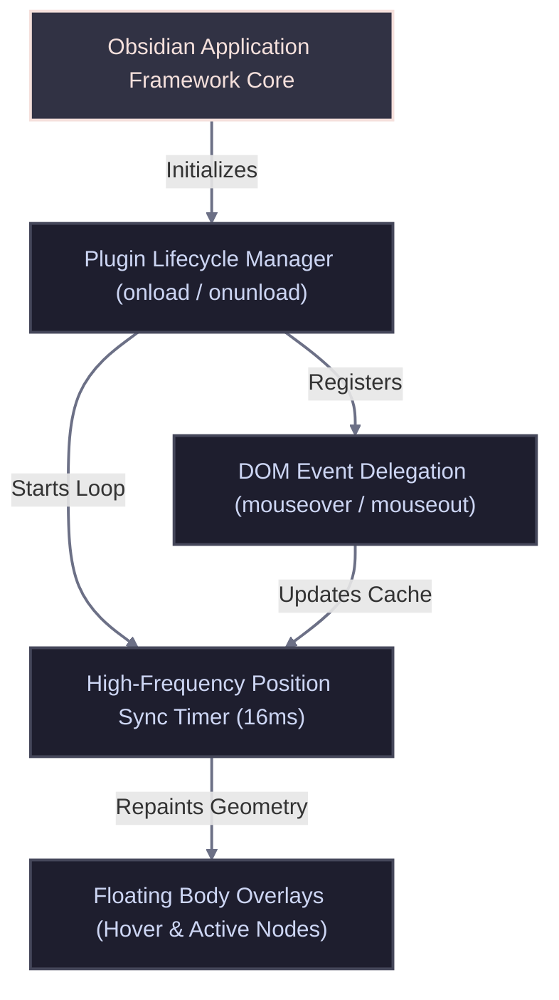

<!-- TEMPLATE: MANUAL.template.md -->
<!-- MANUAL Any text bounded by double curly braces {{like this}} is a placeholder for you to fill out. Replace those placeholders with real paths, rules, and project constraints. INSTRUCTIONS FOR THE AI AGENT: This file is the developer's handbook. It maps structural topologies, data flow, core algorithms, algebraic formulas, configuration guidelines, and technical specifications. -->
<!-- markdownlint-disable MD013 -->

# MANUAL

<!-- TOC location -->
## 🔍 Table of Contents
<!-- Maintained by script -->
- [MANUAL](#a-manual)  ^toc-manual
  - [📑 AI Primary Files](#a-aiprimaryfiles)  ^toc-aiprimaryfiles
  - [📥 Installation & Initial Deployment](#a-installationinitialdeployment)  ^toc-installationinitialdeployment
    - [Setup Sequence](#a-setupsequence)  ^toc-setupsequence
  - [🏗️ 1. Architecture Overview](#a-1architectureoverview)  ^toc-1architectureoverview
  - [🧠 2. Core Modules & Systems](#a-2coremodulessystems)  ^toc-2coremodulessystems
  - [🔎 3. Core Algorithm & Mathematical Formulas](#a-3corealgorithmmathematicalformulas)  ^toc-3corealgorithmmathematicalformulas
  - [🛰️ 4. Commands, Keybindings & Context Flags](#a-4commandskeybindingscontextflags)  ^toc-4commandskeybindingscontextflags
  - [🔧 5. Workspace Build & Configuration](#a-5workspacebuildconfiguration)  ^toc-5workspacebuildconfiguration
  - [🔍 Diagnostics & Common Troubleshooting](#a-diagnosticscommontroubleshooting)  ^toc-diagnosticscommontroubleshooting
    - [Known Failure States & Remediations](#a-knownfailurestatesremediations)  ^toc-knownfailurestatesremediations
      - [🚨 Symptom: "Neon borders appear detached or drift away from elements during fast scrolling"](#a-symptomneonbordersappeardetachedordriftawayfromelementsduringfastscrolling)  ^toc-symptomneonbordersappeardetachedordriftawayfromelementsduringfastscrolling
      - [🚨 Symptom: "The color rotating borders stop rendering entirely inside the application"](#a-symptomthecolorrotatingbordersstoprenderingentirelyinsidetheapplication)  ^toc-symptomthecolorrotatingbordersstoprenderingentirelyinsidetheapplication
  - [🚀 Go to...](#a-goto)  ^toc-goto

[TOC](#toc-manual)

## 📑 AI Primary Files
[TOC](#toc-aiprimaryfiles)

- 🔹 [AGENTS.md](../AGENTS.md)
- 🔹 [ARCHIVE.md](ARCHIVE.md)
- 🔹 [BUILD.md](BUILD.md)
- 🔹 [CODE.md](CODE.md)
- 🔹 [DESIGN.md](DESIGN.md)
- 🔹 [FEATURES.md](FEATURES.md)
- 🔹 [LOG.md](LOG.md)
- 🔸 [MANUAL.md](MANUAL.md)
- 🔹 [README.md](../README.md)
- 🔹 [SPEC.md](SPEC.md)
- 🔹 [TASKS.md](TASKS.md)
- 🔹 [TERMS.md](TERMS.md)
- 🔹 [TESTING.md](TESTING.md)
- 🔹 [VERSIONS.md](VERSIONS.md)

---

---

## 📥 Installation & Initial Deployment
[TOC](#toc-installationinitialdeployment)

### Setup Sequence
[TOC](#toc-setupsequence)

- 1. **Compile/Build Assets:** Run `npm run build` as documented in [BUILD.md](BUILD.md) to generate the target distribution files.
- 2. **Apply Configurations:** Navigate to the Obsidian test vault directory path `.obsidian/plugins/` and create the target plugin subdirectory named `op-file-tree-selector-hue-rotate`.
- 3. **Register Components:** Transfer both `main.js` and `manifest.json` files directly into the target subdirectory, then navigate into the application interface to safely enable the plugin.

---

## 🏗️ 1. Architecture Overview
[TOC](#toc-1architectureoverview)

The plugin leverages a decentralized global layer model. Event delegates trace cursor actions, passing coordinates directly to high-frequency synchronization timers that dynamically reshape absolute body-level overlay boundaries.

---

## 🧠 2. Core Modules & Systems
[TOC](#toc-2coremodulessystems)

- **`Plugin Engine Constructor`**: Sets base layout object properties to null (`hoverOverlayEl`, `activeOverlayEl`, `lastHoveredRow`) and handles standard system setup operations.
- **`DOM Event Delegate`**: Hooks handlers to `document.body` to listen for mouse movements over internal target rows matching the structural `.tree-item-self` descriptor query.
- **`High-Frequency Coordinator`**: Manages the persistent background polling timer block executing at a 16ms cadence to dynamically reposition bounding boxes around current target elements.
- **`Interface Modal Interceptor`**: Evaluates whether system menu bars, notice panels, dropdown selectors, or command prompts occupy layout viewport rows, toggling visibility states off to prevent overlay overlap.

---

## 🔎 3. Core Algorithm & Mathematical Formulas
[TOC](#toc-3corealgorithmmathematicalformulas)

- **`Bounding Rect Coordinate Matrix Mapping`**: Coordinates are calculated dynamically using the layout metrics returned via the native browser viewport bounding engine API.

  $$\text{Overlay}_{\text{width}} = \text{Element}_{\text{right}} - \text{Element}_{\text{left}}$$
  $$\text{Overlay}_{\text{height}} = \text{Element}_{\text{bottom}} - \text{Element}_{\text{top}}$$
  $$\text{Overlay}_{\text{top}} = y_{\text{viewport}} \quad , \quad \text{Overlay}_{\text{left}} = x_{\text{viewport}}$$

- **`Color Frame Phase Interpolation`**: The rotation path sequences solid keyframe transitions through cylindrical color models by keeping lightness and saturation properties constant while scaling step increments.

  $$\text{Color}_{\text{step}}(n) = \text{hsl}\left( \frac{360 \cdot n}{N}, \, 85\%, \, 60\% \right)$$
  *(where $n$ represents the individual step index from $0$ to a total frequency count $N=6$)*

---

## 🛰️ 4. Commands, Keybindings & Context Flags
[TOC](#toc-4commandskeybindingscontextflags)

- **Interface Interaction Elements**:
  - **Hover Action**: Triggers when cursor enters a structural `.tree-item-self` layout block; immediately binds coordinates to the fast-spinning hover layout frame.
  - **Selection Switch**: Intercepts active selection target rows containing the class selector `.tree-item-self.is-active`, transitioning presentation states smoothly.
  - **Modal Activation**: Toggles context blocks if target strings like `.modal-container` or `.menu` populate on screen, enforcing absolute safety overrides.

---

## 🔧 5. Workspace Build & Configuration
[TOC](#toc-5workspacebuildconfiguration)

- **`manifest.json`:** Core static parameters framework file.
  - **Purpose:** Declares configuration settings to the host workspace application engine.
  - **Format:** Flat JSON file layout context structure.
  - **Details:** Contains fields specifying `id`, `name`, `version`, `minAppVersion`, `description`, and `author`.

---

## 🔍 Diagnostics & Common Troubleshooting
[TOC](#toc-diagnosticscommontroubleshooting)

### Known Failure States & Remediations
[TOC](#toc-knownfailurestatesremediations)

#### 🚨 Symptom: "Neon borders appear detached or drift away from elements during fast scrolling"
[TOC](#toc-symptomneonbordersappeardetachedordriftawayfromelementsduringfastscrolling)
- **Root Cause:** High scrolling velocities outpace standard DOM layout pipeline recalibration loops, causing cached bounding rectangle positions to momentarily lag behind physical viewport row movements.
- **Remediation:** Ensure the high-frequency polling runtime routine remains set to a 16ms cadence and check that your computer graphics card processing is not introducing frame rendering limits to the browser surface.

#### 🚨 Symptom: "The color rotating borders stop rendering entirely inside the application"
[TOC](#toc-symptomthecolorrotatingbordersstoprenderingentirelyinsidetheapplication)
- **Root Cause:** A modal or settings dialogue instance failed to clear its layout flags cleanly from the application layout space, causing the modal inspector loop to continually force element opacity values back to zero.
- **Remediation:** Toggle the plugin setting off and back on via the Community Plugins panel to clear internal reference blocks and force-reset the coordinate synchronization state tracking loops.

---

## 🚀 Go to...
[TOC](#toc-goto)

- 🔹 [AGENTS.md](../AGENTS.md)
- 🔹 [ARCHIVE.md](ARCHIVE.md)
- 🔹 [BUILD.md](BUILD.md)
- 🔹 [CODE.md](CODE.md)
- 🔹 [DESIGN.md](DESIGN.md)
- 🔹 [FEATURES.md](FEATURES.md)
- 🔹 [LOG.md](LOG.md)
- 🔸 [MANUAL.md](MANUAL.md)
- 🔹 [README.md](../README.md)
- 🔹 [SPEC.md](SPEC.md)
- 🔹 [TASKS.md](TASKS.md)
- 🔹 [TERMS.md](TERMS.md)
- 🔹 [TESTING.md](TESTING.md)
- 🔹 [VERSIONS.md](VERSIONS.md)

<!-- TEMPLATE: MANUAL.template.md -->
